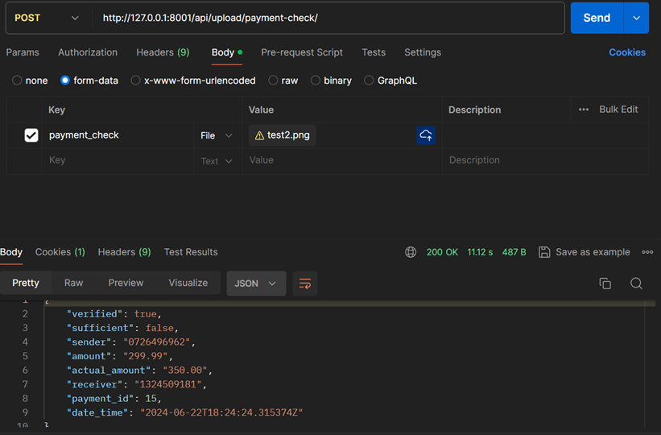

# Payment Verification System

## Overview

The Payment Verification System is an automatic debit accounting system based on incoming payment documents (PDF or image ), that allows users to verify payments without linking their bank cards to the insurance company's website. The system consists of two main components: a Bank Website and an Insurance Company Website. Users can upload payment checks (in PDF or image formats), which are processed using Optical Character Recognition (OCR) and regular expressions to extract important information such as the payment number, amount, and recipient. This information is then verified against the bank's records.

## Features

- **User Registration & Authentication**: Users can register and log in to their accounts securely.
- **Payment Check Upload**: Users can upload their payment checks to verify the payment against the bank's records.
- **OCR Processing**: The system uses OCR technology to extract relevant data from uploaded payment checks.
- **Payment Verification**: The application verifies the payment amount and recipient with the bank using an API.
- **Insurance Package Management**: Users can view and purchase insurance packages based on their uploaded payment checks.

## Technologies Used

- **Backend**: Django, Django REST Framework
- **Frontend**: React, Bootstrap
- **OCR**: Tesseract OCR
- **Other Libraries**: PyMuPDF (for PDF processing), Pillow (for image handling), Requests (for API calls), etc.

## Usage
- Register a new account on the insurance website.
- Log in to your account.
- choose an insurance package to buy
- pay from the bank website and download the check (PDF or image)
- Upload the payment check (PDF or image) to verify your payment.
- The system will extract relevant information using OCR and verify it -against the bank's records.

## Screenshots

### Payment Verifiction Postman

### Payment Verifiction Frontend

## Contributing

Contributions are welcome! Please open an issue or submit a pull request for any improvements or bug fixes.

## License

This project is open-source and licensed under the MIT License.
